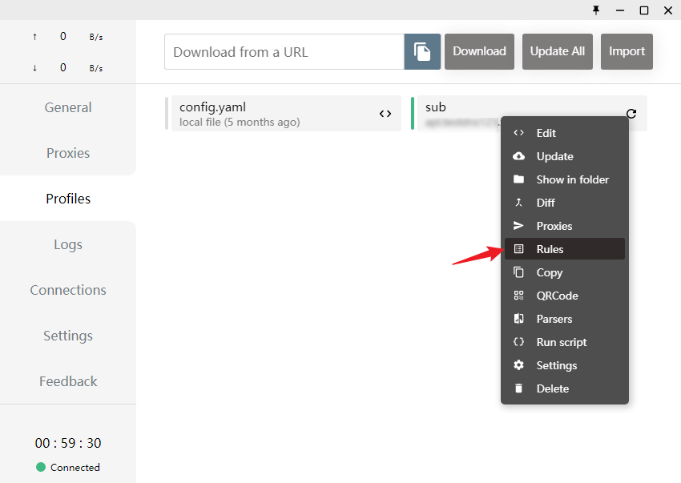

🍉 2023 年 02 月

## 🍀 2023 年 02 月 17 日

  
 Clash 配置规则  
  -   
  -   
  
  

  ...  

## 🍀 2023 年 02 月 18 日

 terminal / console / shell  
 [终端、Shell、tty 和控制台（console）有什么区别？ - 知乎](https://www.zhihu.com/question/21711307/answer/2231006377)  
 [【技术杂谈】shell和terminal_哔哩哔哩_bilibili](https://www.bilibili.com/video/BV16A411675V/?vd_source=676f8b24b99c148b1b81e4550ddd2284)  
  
  
## 迁移微博上的零散记录  
 [Vscode编辑markdown代码块（snippets） - 简书](https://www.jianshu.com/p/a87e9ca2d208?continueFlag=1a6858f6fb4408699aac448881c8e557)  
 [VsCode中使用Emmet神器快速编写HTML代码 - 浮云也是种寂寞 - 博客园](https://www.cnblogs.com/summit7ca/p/6944215.html?continueFlag=1a6858f6fb4408699aac448881c8e557)  
  
 [问了尤雨溪25个问题后，我的很多想法开始变了](https://mp.weixin.qq.com/s/Dopiz0jgqJiSbhLOLzkQbA)  
 [javascript - 油猴脚本编写教程 - 太不白的学习频道 - SegmentFault 思否](https://segmentfault.com/a/1190000021654926)  
  
 [【2233壁纸专栏】献给b站的每个人～ - 哔哩哔哩](https://www.bilibili.com/read/cv735198)  
  
 外部 css 导入失败，提示 MIME type 不对，可以直接换了 URL 试试  
  - [Refused to apply style from &lt;URL&gt; because its MIME type ('text/html') is not a supported stylesheet MIME type, and strict MIME checking is enabled angular · Issue #170 · froala/angular-froala · GitHub](https://github.com/froala/angular-froala/issues/170)  
  
 [你管这破玩意儿叫 Token?](https://mp.weixin.qq.com/s/StIo-eC-7UeBr-fb6lIZkQ)  
  
 [拜访了这位小哥的GitHub后，我失眠了！](https://mp.weixin.qq.com/s/0nn3sss9LQi_kM9iT1QW7A)  
  - [GitHub - jwasham/coding-interview-university: A complete computer science study plan to become a software engineer.](https://github.com/jwasham/coding-interview-university)  
 [这个 GitHub 项目能克隆你的声音](https://mp.weixin.qq.com/s/f2EgnA-aC9aB3XitYI9hog)  
  
 [剖析 Vue.js 内部运行机制 - 染陌同学 - 掘金小册](https://juejin.cn/book/6844733705089449991)  
  
 [Cloud Native App Initializer](https://start.aliyun.com/)  
 [阿里云知行动手实验室-在浏览器沉浸式学习最新云原生技术](https://start.aliyun.com/handson-lab?spm=a2ck6.14145464.0.0.503c7f23wyrpbp)  
  
 [学习操作系统的知识，看哪本书好？ - 知乎](https://www.zhihu.com/question/27871198/answer/1157773248)  
  - [TeachYourselfCS-CN/TeachYourselfCS-CN.md at master · izackwu/TeachYourselfCS-CN · GitHub](https://github.com/izackwu/TeachYourselfCS-CN/blob/master/TeachYourselfCS-CN.md)  
  - [[2020 SP] 清华大学 Operating System 操作系统 RISC-V [To do] · Yuque](https://www.yuque.com/ob26eq/nshoar/hwcvgp)  
  - [[2015 SP] 北京大学 Principles of Operating System 操作系统原理 by 陈向群 · Yuque](https://www.yuque.com/ob26eq/nshoar/mhvtss)  
  
 [前端安全 - 美团技术团队](https://tech.meituan.com/tags/%E5%89%8D%E7%AB%AF%E5%AE%89%E5%85%A8.html)  
  - [前端安全系列（一）：如何防止XSS攻击？ - 美团技术团队](https://tech.meituan.com/2018/09/27/fe-security.html)  
  - [前端安全系列（二）：如何防止CSRF攻击？ - 美团技术团队](https://tech.meituan.com/2018/10/11/fe-security-csrf.html)  
  
 [终于有人把零拷贝Zero-Copy讲懂了 - 知乎](https://zhuanlan.zhihu.com/p/302995249)  
  
 HTTP 请求模拟/fake  
  - [httpbin.org](http://httpbin.org/#/Images/get_image_jpeg?continueFlag=1a6858f6fb4408699aac448881c8e557)  
  - [JSONPlaceholder - Free Fake REST API](https://jsonplaceholder.typicode.com/?continueFlag=1a6858f6fb4408699aac448881c8e557)  
  
 [GitHub - google/zx: A tool for writing better scripts](https://github.com/google/zx)  
  - [【催学社】zxjs 可以使用 JS 来代替 Shell 啦 用起来可真爽！！！_哔哩哔哩_bilibili](https://www.bilibili.com/video/BV1Tv411n7EA/?vd_source=676f8b24b99c148b1b81e4550ddd2284)  
  
 [MySQL Explain详解 - GoogSQL - 博客园](https://www.cnblogs.com/xuanzhi201111/p/4175635.html?continueFlag=1a6858f6fb4408699aac448881c8e557)  
  
 git 使用 switch 代替 checkout  
  - [工具系列 | git checkout 可替换命令 git switch 和 git restore - Tinywan - 博客园](https://www.cnblogs.com/tinywan/p/12344267.html?continueFlag=1a6858f6fb4408699aac448881c8e557)  
  - [git switch branch vs checkout - Easily switch branches](https://bluecast.tech/blog/git-switch-branch/?continueFlag=1a6858f6fb4408699aac448881c8e557)  
  - [Git - git-switch Documentation](https://git-scm.com/docs/git-switch?continueFlag=1a6858f6fb4408699aac448881c8e557)  
  
 [BootCDN - Bootstrap 中文网开源项目免费 CDN 加速服务](https://www.bootcdn.cn/?continueFlag=1a6858f6fb4408699aac448881c8e557)  
 [dayjs (v1.11.7) - Day.js 是一个轻量的处理时间和日期的 JavaScript 库，和 Moment.js 的 API 设计保持完全一样. 如果您曾经用过 Moment.js, 那么您已经知道如何使用 Day.js | BootCDN - Bootstrap 中文网开源项目免费 CDN 加速服务](https://www.bootcdn.cn/dayjs/?continueFlag=1a6858f6fb4408699aac448881c8e557)  
  
 [Electron + Vue3 开发跨平台桌面应用【从项目搭建到打包完整过程】 - 掘金](https://juejin.cn/post/6983843979133468708)  
  
 SWIG 跨语言调用  
  - [Simplified Wrapper and Interface Generator](https://www.swig.org/?continueFlag=1a6858f6fb4408699aac448881c8e557)  
  
  
  

  ...  

## 🍀 2023 年 02 月 19 日

  
 [MIUI+](https://plus.miui.com/#menu-anchor-recommend)  
  - 链接：https://pan.baidu.com/s/1oo9SQ3HPzeR7sPjn8OoLTA?pwd=s3s1   
    提取码：s3s1  
  
  

  ...  

## 🍀 2023 年 02 月 21 日

 植物大战僵尸，哈哈哈  
  - [植僵工具箱](https://pvz.tools/)  
  - [星空之旅|植物大战僵尸JAVASCRIPT版|JSPVZ](http://jspvz.com/)  
  

  ...  

## 🍀 2023 年 02 月 22 日

  
 [ElasticView - Elasticsearch 可视化客户端](http://www.elastic-view.cn/ )  
  - [1340691923/ElasticView: 这是一个简单好用的ElasticSearch可视化客户端，支持连接6，7，8版本的ES，不妨一试](https://github.com/1340691923/ElasticView )  
  

  ...  

## 🍀 2023 年 02 月 23 日

  
## Resilio Sync && ZeroTier  
  - [Resilio File Sync Software | Unify, Control, and Accelerate Global Enterprise File Workflows](https://www.resilio.com/ )  
  - [它一度被墙，如今又悄然复活，为你轰开一个隐秘新世界 - 知乎](https://zhuanlan.zhihu.com/p/280756218 )  
  - [内网穿透神器 ZeroTier组件自己的”大局域网”使用教程 | STGOD](https://stgod.com/4419/ )  
  - [ZeroTier, Inc. · GitHub](https://github.com/zerotier )  
  - [ZeroTier - 无配置，零基础「内网穿透」随时随地连回家/学校/办公室 [跨平台] - 小众软件](https://www.appinn.com/zerotier-one/ )  
  - [如何解决 Resilio Sync 无法正常同步的问题 – 书伴](https://bookfere.com/post/581.html )  
  
 远程桌面工具：  
  - [Connect to Work or Games from Anywhere | Parsec](https://parsec.app/)  
  - 结合 ZeroTier 使用，简直完美  
  
  

  ...  

## 🍀 2023 年 02 月 25 日

  
 云盘聚合 / 网盘聚合  
  - [Home | AList Docs](https://alist.nn.ci/ )  
  
  

  ...  

## 🍀 2023 年 02 月 27 日

  
 [AwA | HANDSOME-CSS3-LIB](https://www.handsome-css.com/ )  
  - 这个网站收集各种 CSS 特效和组件  
  
  

  ...  
